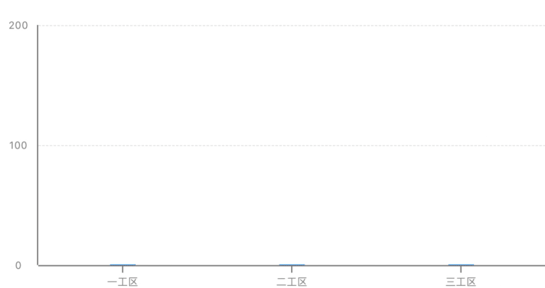

# iOS-UI之简易图表 for Swift<br>
这是与OC版本图表相对应的Swift版本图表控件，和OC版本的图标相比，做了一些改进，比如去掉了图例、饼图增加了不同半径的扇形显示、加上了负轴柱状图和其他一些优化，并且可以直接在xib上使用<br>
1. 饼图(扇形图)<br>

 
 
 
 
 

2. 圆环图(和饼图类似)<br>
 

3. 柱状图<br>
 
 
 
 
 

4. 雷达图<br>
 
 
 

5. 折线图<br>
        暂时未完成<br>

## 实现过程
实现思路可以参考OC版<br>
OC版本地址：<https://github.com/MichaelJackchuang/GCChart><br>
## 一、饼图(扇形图)
### 设置参数
``` Swift
    /// 是否为双层饼图
    var isDoubleCircle:Bool = false
    /// 是否显示标注
    var showMark:Bool = false
    /// 是否显示百分比（前提是showMark为true）
    var showPercentage:Bool = false
    /// 是否在饼状图扇区中间显示百分比
    var showPercentageInPie:Bool = false
    /// 是否为不同半径弧形（顺时针半径递增）
    var differentRadiusArc:Bool = false
    /// 是否显示扇区阴影
    var showArcShadow:Bool = false
    /// 扇形颜色数组
    var colorArray = [String]()
    /// 外环数据颜色（二维数组）
    var outsideColorArray = [[String]]()
    /// 数据数组，单层饼图的时候使用这个数组
    var pieDataArray = [String]()
    /// 内层数据数组，双层饼图的时候使用这个数组（非必须，可根据外层数据数组计算得出）
    var pieInsideDataArray = [String]()
    /// 外层数据数组，双层饼图的时候使用这个数组（二维数组，与内层数组属于对应关系，即对应项的和相等）
    var pieOutsideDataArray = [[String]]()
    /// 单层圆环半径 或双层圆环外层半径
    var radius:CGFloat = 60
    /// 数据标签数组
    var pieDataNameArray = [String]()
    /// 外层数据标签数组（双层饼图）
    var pieOutsideNameArray = [[String]]()
    /// 数据标注单位
    var pieDataUnit:String = ""
    /// 标注连接线颜色
    var markLineColor:UIColor = UIColor.colorWithHexString(color: "dcdcdc")
    /// 标注连接线线宽
    var markLineWidth:CGFloat = 0.5
```
圆环图和饼图的计算方式一样，区别在于饼图绘制扇区的时候是设置的CAShapeLayer的fillColor而圆环图设置的是strokeColor和lineWidth，fillColor。简单来说就是一个填充，一个画线。

## 二、柱状图
### 设置参数
``` Swift
    /// 是否为单柱
    var isSingleColumn:Bool = true
    /// 数据标签数组
    var dataNameArray = [String]()
    /// 单柱数据数组
    var singleDataArray = [String]()
    /// 多柱数据数组（二维数组）
    var multiDataArray = [[String]]()
    /// y轴刻度值，递增，设置此数组则不自动计算y轴刻度值，传入刻度时必须包含0
    var yAxisNums = [String]()
    /// 柱体是否为渐变色
    var isColumnGradientColor:Bool = false
    /// 单柱颜色
    var singleColor:String = ""
    /// 多柱颜色数组
    var multiColorArray = [String]()
    /// 单柱渐变色数组
    var singleGradientColorArray = [String]()
    /// 多柱渐变色数组（二维数组）
    var multiGradientColorArray = [[String]]()
    /// x轴标题
    var xAxisTitle:String = ""
    /// y轴标题
    var yAxisTitle:String = ""
    /// 柱体宽度 （多柱若每组数量过多请务必要设置此属性，否则会默认为20）
    var columnWidth:CGFloat = 20
    /// 是否线束数据水平线
    var showDataHorizontalLine:Bool = true
    /// 每组柱体数量
    var numberOfColumn:CGFloat = 1
    /// 柱顶是否显示具体数据
    var showDataLabel:Bool = false
    /// 是否可以滚动
    var scrollEnabled:Bool = true
```
## 四、雷达图
### 设置参数
```Swift
    /// 分组名称数组
    var radarNameArray = [String]()
    /// 数据数组（数据个数在3~8个时候为最佳超过8个不保证UI效果）
    var radarDataArray = [String]()
    /// 数据最大值（必填项，不设置的话无法计算，则无法绘图）
    var maxValue:String = ""
    /// 是否填充颜色（默认否）
    var isFilledColor:Bool = false
    /// 雷达填充颜色
    var radarFillColor:String = "f5447d"
    /// 填充颜色不透明度
    var radarFillColorOpacity:CGFloat = 1
    /// 雷达线条颜色
    var radarLineColor:String = "f5447d"
    /// 雷达线宽
    var radarLineWidth:CGFloat = 1
    /// 是否显示具体数值
    var showDataLabel:Bool = false
    /// 是否显示尖角圆点
    var showPoint:Bool = false
    /// 是否显示中心圆点
    var showCenter:Bool = false
    /// 是否显示背景线
    var showBgLine:Bool = false
    /// 背景线 颜色（默认为黑色)
    var bgLineColor:String = "000000"
    /// 是否显示背景色
    var showBgColor:Bool = false
    /// 雷达背景色（默认为白色)
    var radarBgColor:String = "ffffff"
    /// 动画风格（默认无动画）
    var animationStyle:GCRadarChartViewAnimationStyle = .none
```
此处雷达图提供了两种动画方式，一种是类似于饼图的顺时针环形填充，还有一种就是放大效果<br>
动画风格的枚举
```Swift
enum GCRadarChartViewAnimationStyle {
    case none // 无动画
    case scale // 放大
    case circleStroke // 环形填充
}
```
## 三、折/曲线图
折线图是最复杂的，稍后再加上来<br>
<!-- ### 设置参数
```Swift
``` -->

##  Tip
* 由于在内部重写了awakeFromNib方法，所以可以在xib上直接使用，拖一个空白view，将其class改为你要的图表的类名，在代码里设置属性就可以了。<br>
* 重写了layoutSubviews方法，frame的获取都是在布局完成之后的。<br>
* <font color=#ff0000 size=5>重要！！！约束布局使用了SnapKit，请提前在项目中集成，若不想集成则手动添加约束，或者获取屏幕宽度来进行相关计算，设置固定视图大小。</font><br>

另：OC版本地址：<https://github.com/MichaelJackchuang/GCChart>